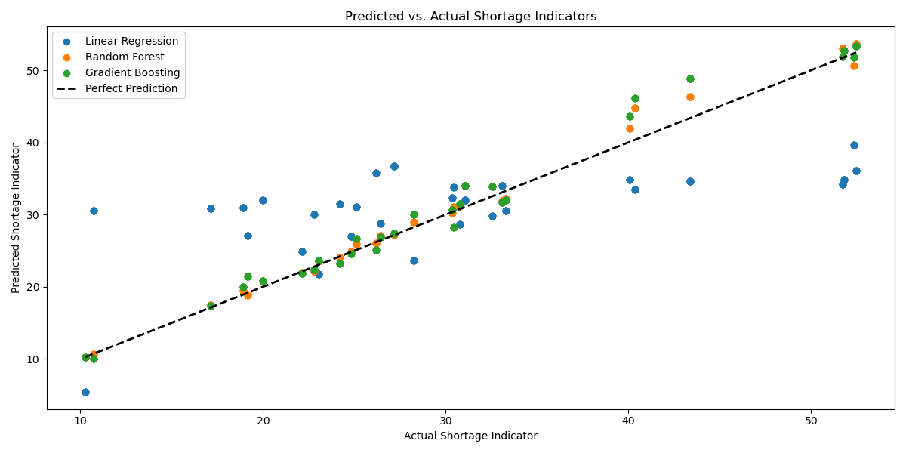

# Executive Summary: Predicting Affordable Housing Shortages

## Project Overview
The "Predicting Affordable Housing Shortages" project aims to forecast regions at risk of affordable housing shortages over the next 5 to 10 years. The analysis focuses on major metro areas in the United States, leveraging a wide range of datasets to identify underlying trends and predictors of housing affordability challenges. This project provides actionable insights for policymakers, urban planners, and stakeholders to mitigate the impact of housing shortages.

## Data Sources

The project integrates both raw and preprocessed data from reputable sources, categorized into the following domains:
1. Affordability Metrics:
    * Cost burden data (2006-2021) across metro areas.
    * Housing costs, including metro housing prices.
2. Housing Supply:
    * Residential construction permits (2000-2022).
3. Demand Indicators:
    * Migration patterns and population dynamics (historical and projected).
    * Economic factors such as wages and unemployment rates.

For more detailed information on Data sources see [directory data_info](OneDrive/general_assembly_dsb/project_capstone/data/data_info). 

## Key Findings

1. Housing Cost Burden Trends:
    * Metro areas like New York-Newark-Jersey City consistently exhibit the highest housing cost burdens, with percentages exceeding 100% in recent years. This indicates severe affordability issues where a large proportion of residents spend more than 30% of their income on housing.
    * In contrast, regions such as Miami-Fort Lauderdale-West Palm Beach and Washington-Arlington-Alexandria display relatively lower housing cost burdens (below 10%), suggesting fewer affordability challenges.
    * Philadelphia-Camden-Wilmington displayed notable fluctuations in housing cost burdens over the years, possibly influenced by economic policies or crises, highlighting the dynamic nature of affordability in this area.

2. Geographic Distribution of Housing Cost Burden:
    * A choropleth map of housing cost burdens reveals stark disparities across metro areas.
    * New York-Newark-Jersey City emerged as the most burdened region, followed by Los Angeles-Long Beach-Anaheim and Chicago-Naperville-Elgin, where cost burdens remain a significant challenge.
    * The visualization highlights regions with urgent needs for affordable housing initiatives, aiding policymakers in prioritizing interventions.

3. Predictive Modeling of Housing Shortages:
    * Using Random Forest models, predictions indicate that metro areas with high current cost burdens are also at the greatest risk of facing future affordable housing shortages.
    * The Shortage Indicator—a ratio of cost-burdened households to total households—was developed to quantify affordability challenges. Predictions suggest that shortages will intensify in regions like New York, Los Angeles, and Chicago over the next decade.

4. Model Performance:
    * Random Forest models outperformed Linear Regression and Gradient Boosting in predicting housing shortages, achieving the lowest Root Mean Squared Error (1.36) and Mean Absolute Error (0.94).
    * Gradient Boosting was a close second in performance, while Linear Regression struggled to capture complex relationships inherent in the data.

## Future Directions

This project serves as a foundational framework for addressing housing affordability challenges. Future enhancements may include:
1. Expanding datasets to incorporate zoning laws and infrastructure developments.
2. Enhancing predictive models with additional socioeconomic indicators.
3. Developing an interactive dashboard for real-time housing shortage predictions.

